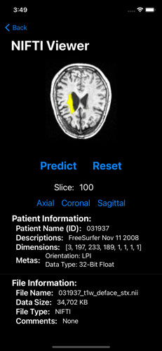

# VCA-Net
Official Repository for Stroke Lesion Segmentation with Visual Cortex Anatomy Alike Neural Nets. arXiv:2105.06544

https://arxiv.org/abs/2105.06544

 

This is only a preliminary research and shall be updated as my research goes on.

I have read plenty of papers but still am not convinced that this is a meaningful research regarding actual stroke imaging use cases. 
Even though with a prototype stroke imaging application is developed. 
At least it is not when I mentioned this research with my mentor, who is a world-wide expert in Stroke and Imaging.

Deep learning based models (to MRI/CT images) could lead to some good results, but lack of interpretability and are not that useful comparing to other imaging techniques.
There has existed plently of different deep learning based networks, each with good results, maybe slightly better than one another, but no significant improvement.
The architecture varies slightly with different meaningless matrix operations and tensor concatenations, even in my own paper.
However, some sophiscated operations which do have meaningful explanations should definitely be worthy of trying.
And I will also try to manipulate the ops and archs in the future, but, still more focus on the biological interpretations.

Some of the codes are borrowed from other repositories. Thanks to all of them. (I shall already cite their papers, but do let me know if I left out someone's work:)).

 &emsp; &emsp;

    iOS App:

 

* I may update this repo (or create a second repo) with a simple iOS demo app in the near future.
* https://github.com/DarkoBomer/VCANet-iOS
 

<!--  -->
Note:
    
    I will update with a better aligned model, and it seems Dice Loss should be sufficient enough for this model, and the BCELoss is also redundant; 
    I will find time to retrain the net and validate on this issue.
    
 
* Please consider to cite this paper if any idea or code is helpful, and welcome to reach out to me as I will keep researching in similar fields:).

        @article{li2021stroke,
          title={Stroke Lesion Segmentation with Visual Cortex Anatomy Alike Neural Nets},
          author={Li, Chuanlong},
          journal={arXiv preprint arXiv:2105.06544},
          year={2021}
        }
